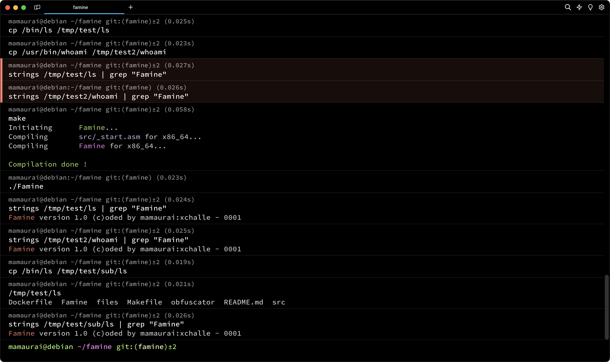
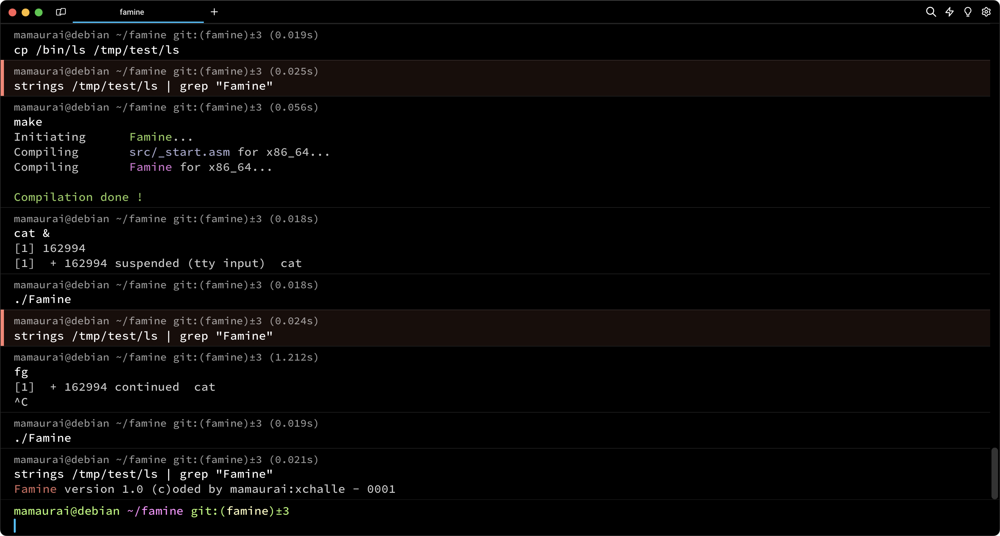
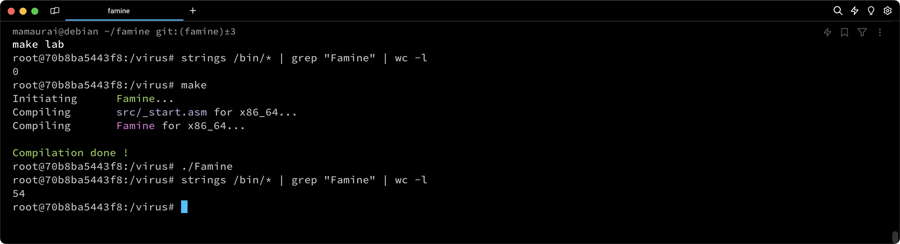
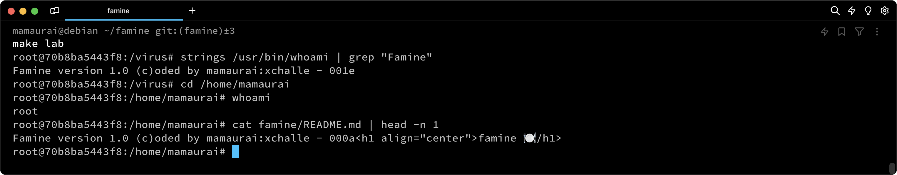

<p align="center">
  
</p>

---
<p align="center">
    
    
    
    
    
</p>


> A Simple Linux 64 bits and 32 bits ELF Virus

## 📝 Table of Contents

* [⛔️ Warning](#-warning)
* [❓ What is it](#-what-is-it)
* [⚙️ How it works](#-how-it-works)
* [⭐ Bonus features](#-bonus-features)
* [📋 Prerequisites](#-prerequisites)
* [🔧 Install](#-install)
* [🚀 Usage](#-usage)

## ⛔️ Warning

The sharing of this project on my GitHub aims to help peoples to open their minds to new logics or help peoples in case of difficulty. In no way, that aims to copy and paste this work on your own repository.

This executable can do great damage to your computer if it is run, I strongly recommend that you run it in a separate and secure environment away from your personal data.

## ❓ What is it

This project aims to create an ELF executable that can embed its own code within a target file. In our case, our target is not a single file but two directories for the mandatory part. Those directories are `/tmp/test` and `/tmp/test2`. To consider a file "infected," the file must contain the virus code that we have coded. It should be executed by the file when you run it without altering its original behavior and without printing anything. Otherwise, our virus would be detected. After being infected, the targeted file will contain a `signature` in this form: `Famine version 1.0 (c)oded by mamaurai:xchalle - 0000`, where `0000` is just an index to determine the infection order of each process.

<p align="center">
  
</p>

## ⚙️ How it works

The core of this program lies in the infection routine. For this part, we employed a classic `PT_NOTE` to `PT_LOAD` technique. We didn't attempt a `PT_LOAD` injection because our code exceeds the PAGE_SIZE (0x1000 bytes). Therefore, we already know that there won't be enough space in the main `PT_LOAD` to inject our code.

The `PT_NOTE` to `PT_LOAD` technique is designed to locate the `PT_LOAD` with the highest virtual address on the ELF program header. In addition to this, we consider its memory size and the result of (`p_offset` & (PAGE_SIZE-1)). This will be the new virtual address of our `PT_NOTE`. Then, we search for the first `PT_NOTE` to change it to `PT_LOAD` type. We also change its virtual address to the new one. After granting execution rights to this segment, we simply need to change the entry point to the end of the file. Finally, we copy our code to the end of the file. Once this is done, we can run the targeted file, and ideally, the file should execute our code first.

## ⭐ Bonus features

This project opens the door to many potential bonuses. For this project, we have decided to implement six bonus features:

<details open>
<summary><b>32 Bits Compatibility</b></summary>
<br>

We decided to leverage the wide possibilities of NASM preprocessing to create a coding approach that works on both 64-bit and 32-bit architectures. Here is how assemble it for 32bits:
```shell
$ make re ARCH=x86_32
$ ./Famine
```

<p align="center">
  
</p>
</details>

<details open>
<summary><b>Conditionnal Infection</b></summary>
<br>

Conditional infection is a fundamental yet well-known technique employed to obfuscate the understanding of how a virus operates. This technique is mandatory in the upcoming virus project at 42. In our case, we have already implemented it as a bonus feature. The condition in our case involves checking if the processes `cat`, `vim`, or `grep` are running. If any of these processes are detected, the virus will refrain from infecting the targeted directories.

<p align="center">
  
</p>
</details>

<details open>
<summary><b>Root Infection</b></summary>
<br>

At the beginning of the infection routine, the virus will query the kernel for the UID to determine whether the executable has been run with root privileges or via sudo. If the UID is greater than zero, the virus will only infect `/tmp/test` and `/tmp/test2`, as explained above. However, if the UID is zero, indicating root privileges, the virus will infect the following directories: `/bin`, `/usr/bin`, `/usr/local/bin`. Subsequently, almost all executables on the machine will be infected and capable of infecting other files. For example, if you run `ls` as root in the `/home` directory, the resulting subfiles will be infected, potentially leading to the corruption of personal files with our signature.

<p align="center">
  
</p>
</details>

<details open>
<summary><b>Non-Binary Infection</b></summary>
<br>

As mentioned above, if the virus is executed as root in the `/home` directory, it will infect non-binary files. In this project, the infection involves placing the virus signature at the top of every file. Later on, we plan to enhance the process by incorporating file encryption.

<p align="center">
  
</p>
</details>

<details open>
<summary><b>Packer</b></summary>
<br>

Our virus implements a packing algorithm called `lzss`. This algorithm is designed to minimize the size of the virus within the targeted ELF. The code will be unpacked during runtime. The algorithm is lossless and relies on the repetition of patterns within the code.
</details>

<details open>
<summary><b>Obfuscation</b></summary>
<br>

The last bonus feature is not an executable feature, this feature is the obfuscation of the source code. This static obfuscation is intended to make the code less understandable for a reverse engineering engineer. Several techniques are employed in our case, such as `useless code injection`, `junk instructions injection`, and `nonlinear code flow`. While these techniques may not be the most efficient, they can be quite deceptive at first glance, especially for a junior engineer.
</details>

## 📋 Prerequisites

This virus has been developed and tested on `Debian 6.1.0-18-amd64`. On other systems, some undefined behavior may occur or certain features may not work as intended.

- `make`
- `nasm`
- `ld`

## 🔧 Install

```sh
$ git clone https://github.com/mathias-mrsn/famine.git
```

## 🚀 Usage

```sh
# Run it in secure environment
$ cd famine
$ make
[...]
$ (sudo) ./Famine
```

## 👥 Authors
- [@mathias-mrsn](https://github.com/mathias-mrsn)
- [@xchalle](https://github.com/xchalle)
